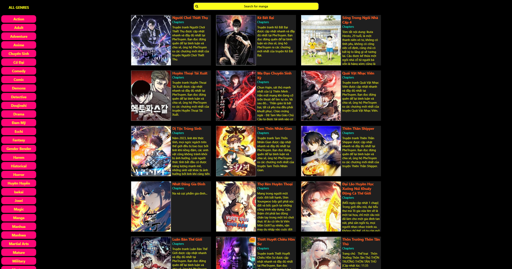
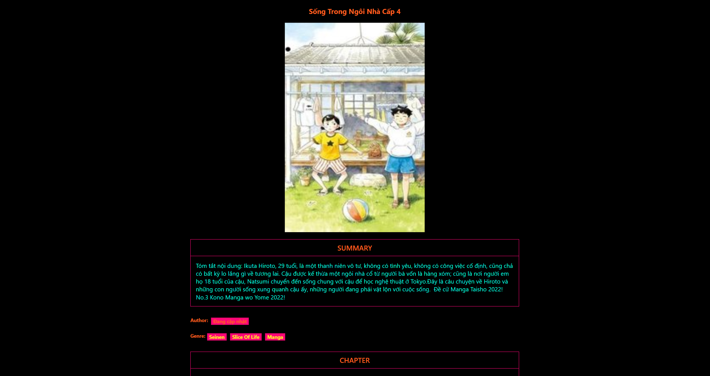

# Manga Reader Project

## Overview

Welcome to the Manga Reader project! This WPF application, powered by AWS, delivers an immersive manga reading experience with a focus on user-friendly features.

## Get the Application

You can get the application from [Google Drive](https://drive.google.com/file/d/19_YLjtKmRmIBC5Yrxojni6KzESWDiWE7/view?usp=sharing).

## Key Features

- **Intuitive Interface:** Enjoy a seamless navigation experience through manga collections with a clean and user-friendly interface.

- **Various Genre:** Immerse yourself in a variety of manga genres.

- **Search for Manga:** Easily find your favorite manga titles or discover new ones with our intuitive search feature. Quickly locate manga based on titles, enhancing your ability to explore and enjoy a vast library of content.

## Screenshots

## Usage

Explore the Manga Reader's rich feature set for an enhanced manga reading experience. Dive into the world of your favorite manga series with ease and enjoy them.

## Acknowledgments

- The manga content featured in this project is not owned by me, and the project is not intended for commercial purposes.
